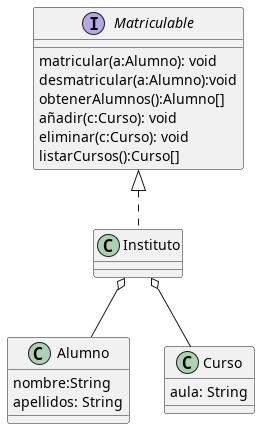

# Ejemplo de colecciones

Este código simula de forma rápida una posible implementación de este diseño utilizando Set y List.

Así mismo, implementa una serie de pruebas rápidas en junit5 para ver su funcionamiento y la versatilidad de la herramienta.